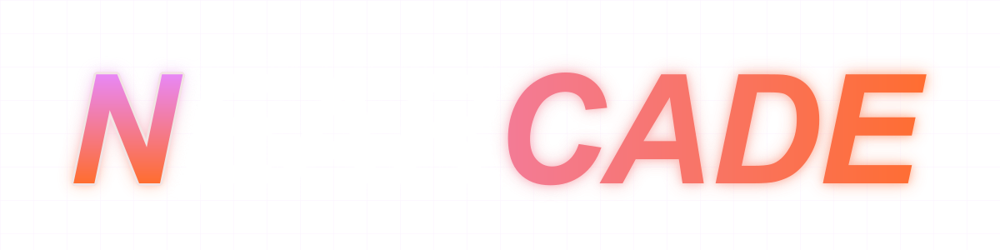
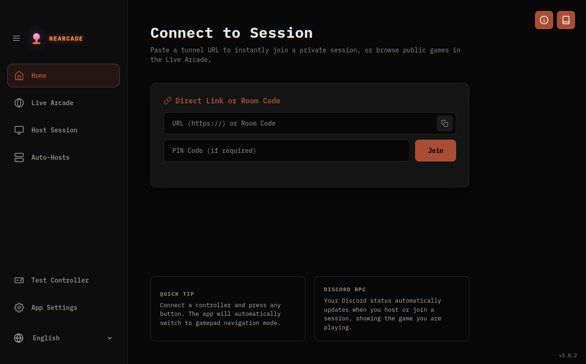
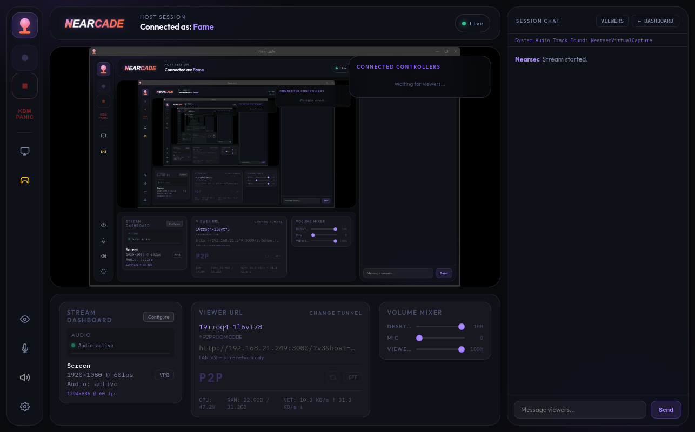
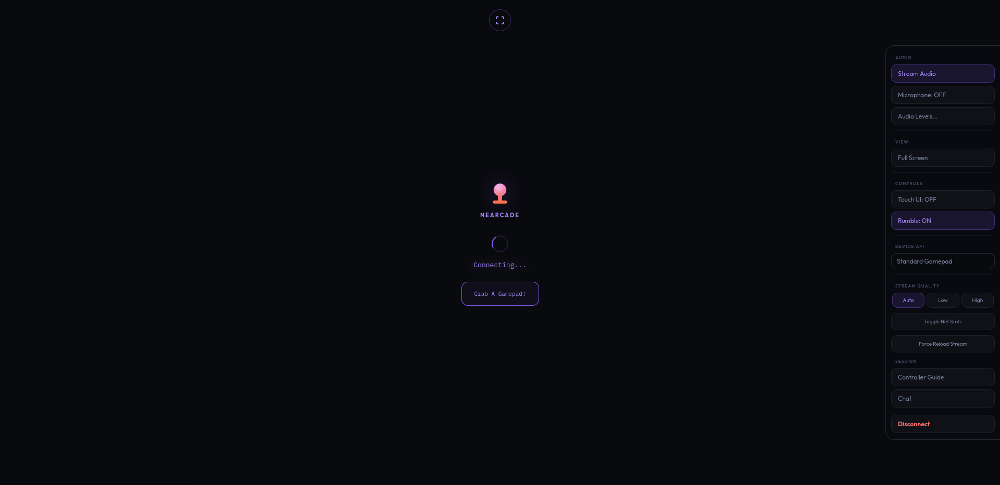
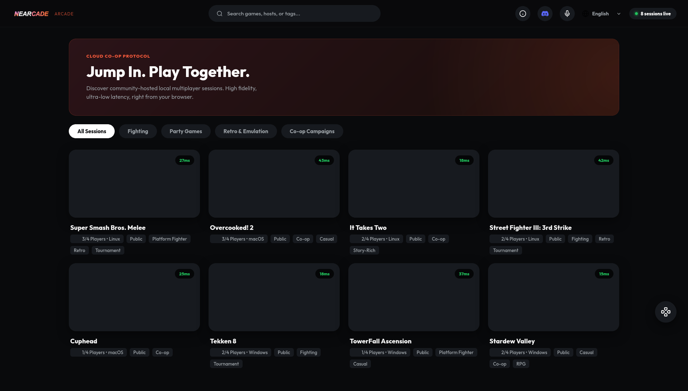

<p align="left">
  
<h1>Nearcade <a href="https://discord.gg/Yz3NeEBdPQ" target="_blank" title="Join our Discord"><svg xmlns="http://www.w3.org/2000/svg" viewBox="0 0 127.14 96.36" width="24" height="18" style="vertical-align:middle;fill:#5865F2;"><path d="M107.7,8.07A105.15,105.15,0,0,0,81.47,0a72.06,72.06,0,0,0-3.36,6.83A97.68,97.68,0,0,0,49,6.83,72.37,72.37,0,0,0,45.64,0,105.89,105.89,0,0,0,19.39,8.09C2.79,32.65-1.71,56.6.54,80.21h0A105.73,105.73,0,0,0,32.71,96.36,77.7,77.7,0,0,0,39.6,85.25a68.42,68.42,0,0,1-10.85-5.18c.91-.66,1.8-1.34,2.66-2a75.57,75.57,0,0,0,64.32,0c.87.71,1.76,1.39,2.66,2a68.68,68.68,0,0,1-10.87,5.19,77,77,0,0,0,6.89,11.1A105.25,105.25,0,0,0,126.6,80.22h0C129.24,52.84,122.09,29.11,107.7,8.07ZM42.45,65.69C36.18,65.69,31,60,31,53s5-12.74,11.43-12.74S54,46,53.89,53,48.84,65.69,42.45,65.69Zm42.24,0C78.41,65.69,73.25,60,73.25,53s5-12.74,11.44-12.74S96.23,46,96.12,53,91.08,65.69,84.69,65.69Z"/></svg></a></h1>

[Inglés](README.md)\|[Español](README.es.md)\|[Francés](README.fr.md)\|[Alemán](README.de.md)\|[portugués](README.pt.md)\|[japonés](README.ja.md)

## Capturas de pantalla: Panel de control, Página del visor, Arcade

<div align="center">
  
  
  
  
</div>

## Misión del proyecto

Nearcade es una plataforma de código abierto que te permite jugar juegos cooperativos locales a través de Internet con amigos. Está diseñado para configuraciones autohospedadas. Utiliza conexiones de igual a igual y enrutamiento de entrada y audio del sistema operativo nativo para mantener bajo el retardo de entrada.

El foco principal son las configuraciones privadas. La aplicación host no requiere ninguna configuración de red especial. Los espectadores se unen a través de un navegador web estándar en dispositivos móviles o de escritorio. La interfaz del visor móvil incluye controles táctiles y un joystick virtual. Los usuarios no necesitan descargar nada para jugar.

## Requisitos del sistema

Necesita un software específico instalado en su máquina para ejecutar la aplicación host.

### Software requerido

-   Node.js versión 18 o posterior.
-   Python 3 para el puente de virtualización del controlador.
-   Git para descargar el código fuente.

### Requisitos de Linux

-   PipeWire debe ser su servidor de audio activo. La aplicación apunta directamente a los nodos PipeWire para separar el audio del juego de los chats de voz. No funcionará con PulseAudio.
-   Su kernel debe tener habilitado el módulo uinput para que la aplicación pueda crear gamepads virtuales nativos.
-   El sistema implementa reglas nativas de udev para bloquear los indicadores de confusión del mouse y el teclado. Esto evita los límites normales de entrada de vapor. El script de configuración proporcionado se encarga de este paso.

### Requisitos de Windows

-   Debe instalar el controlador ViGEmBus manualmente para habilitar la compatibilidad con gamepad en Windows.

### Dependencias agrupadas

La aplicación incluye binarios de Cloudflared y Zrok para crear túneles y los ejecuta de forma nativa. No es necesario instalarlos manualmente. El enrutamiento de la red se basa en un enrutador Rust VPS externo para la señalización, mientras que la transmisión de medios se realiza a través de WebRTC.

## Matriz de soporte de plataforma

| Característica             | linux      | ventanas     | macos        |
| -------------------------- | ---------- | ------------ | ------------ |
| Transmisión WebRTC         | Lleno      | Lleno        | Lleno        |
| Soporte para mandos        | Lleno      | Condicional  | Ninguno      |
| Entrada de teclado y mouse | Lleno      | Limitado     | Lleno        |
| Controlador múltiple       | Lleno      | Limitado     | Ninguno      |
| Reproducción de audio      | Lleno      | Lleno        | Lleno        |
| Nivel de estabilidad       | Producción | Experimental | Experimental |

## Instalación y documentación

La mayoría de los usuarios ejecutarán el archivo ejecutable compilado directamente. La aplicación maneja la configuración del sistema automáticamente al iniciarse.

Solo necesita ejecutar el script de configuración manualmente si está utilizando el código fuente o si la aplicación compilada no puede configurar su sistema. Para ejecutar el script de instalación de Linux manualmente, navegue hasta la carpeta bin desde la raíz del proyecto.

```bash
cd bin
sudo ./linux_setup.sh
```

Mantenemos todas las instrucciones de configuración técnica, listas de dependencias y guías de API en un directorio de documentación dedicado. Esto mantiene limpia la página principal. Puede leer estos archivos desde el ícono del libro Host Dashboard o haciendo clic en los enlaces a continuación.

-   [Guía de introducción](src/docs/GETTING_STARTED.md)
-   [Manual de uso del host](src/docs/HOST_USAGE.md)
-   [API y guía de configuración](src/docs/API_AND_SETUP.md)
-   [Configuración del servidor VPS](src/docs/VPS_SETUP.md)
-   [Documentación de lógica avanzada](src/docs/ADVANCED_LOGIC.md)
-   [Información sobre la sala de juegos Nearcade](src/docs/NEARCADE_ARCADE.md)

## Arcade cercano

La plataforma incluye un sistema de lobby público opcional. Los anfitriones pueden incluir sus sesiones en la cuadrícula Arcade para permitir que los jugadores globales descubran y se unan a juegos cooperativos locales. Puede ver el lobby público en<https://nearcade.cutefame.net>y únete a sesiones activas directamente desde tu navegador.

Este proyecto utiliza modelos de lenguaje grandes de inteligencia artificial para la generación de código y la planificación de estructuras.
