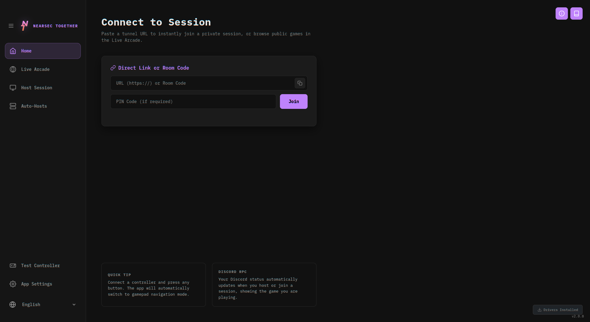
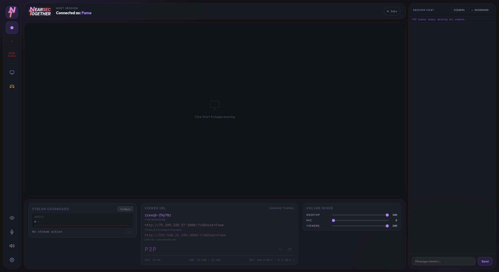
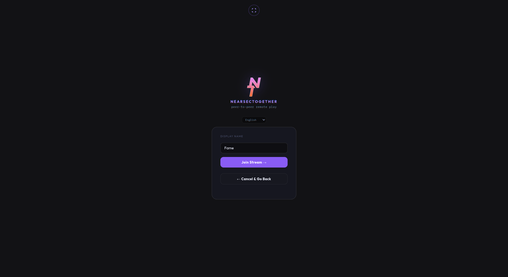
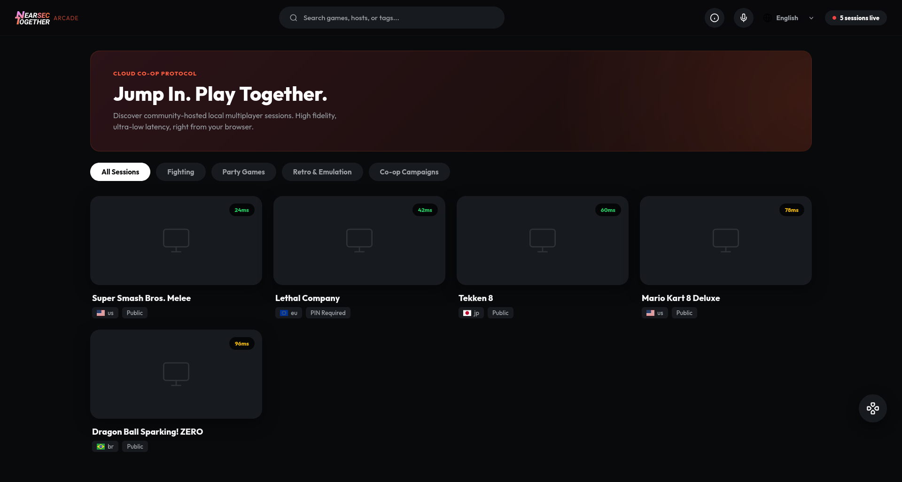

<p align="left">
  
<h1>NearsecTogether</h1>

[English](README.md) | [Español](README.es.md) | [Français](README.fr.md) | [Deutsch](README.de.md) | [Português](README.pt.md) | [日本語](README.ja.md)

## Screenshots -- Dashboard, Viewer Page, Arcade

<div align="center">
  
  
  
  
</div>

## Project Description
NearsecTogether is a low-latency, open-source platform that allows you to play local co-op games over the internet with your friends. By leveraging WebRTC for UDP-first streaming and built-in browser hardware encoders, NearsecTogether provides near-imperceptible latency that rivals commercial cloud gaming platforms — tailored specifically for self-hosted instances.

Unlike traditional cloud gaming solutions that relied on massive data center pipes and custom QUIC/VP9 hardware encoders, NearsecTogether is optimized to work elegantly over a standard home internet connection.

## Technology Stack
- **The Transport**: WebRTC handles jitter buffering and NAT traversal automatically.
- **The Distributor**: To prevent overloading your home network upload bandwidth when streaming to multiple people, you can pair this with an SFU (Selective Forwarding Unit) or use the built-in port forwarding and tunneling options.
- **The Encoder**: The software accesses your system's hardware encoding (NVENC, VAAPI) via the WebRTC API to deliver optimized H.264 or VP8/VP9 streams based on your connection quality.

---

## Platform Support

| Feature | Linux | Windows | macOS |
|---------|:-----:|:-------:|:-----:|
| **WebRTC Streaming** | ✅ | ✅ | ✅ |
| **Gamepad Support** | ✅ Full | ⚠️ Conditional¹ | ❌ None |
| **Keyboard/Mouse Input** | ✅ Full | ⚠️ Limited | ✅ Full |
| **Motion Controls** | ✅ | ❌ | ❌ |
| **Multi-Controller** | ✅ | ⚠️ Limited | ❌ |
| **Audio Playback** | ✅ | ✅ | ✅ |
| **Display Capture** | ✅ | ✅ | ✅ |
| **Stability** | **Production** | **Experimental** | **Experimental** |

¹ Windows gamepad requires [ViGEmBus driver](https://github.com/nefarius/ViGEmBus/releases)

📖 **[→ Detailed Platform Setup Guide](PLATFORM_SETUP.md)** — Step-by-step instructions, troubleshooting, and workarounds for each platform.

---

## Getting Started

### What `./start` handles automatically
- Runs `npm install` if `node_modules` is missing — including Electron.
- Loads the `uinput` kernel module on Linux (via `sudo modprobe uinput`).
- Falls back to headless `node server.js` mode if Electron isn't installed.

### What you must set up yourself

| Dependency | Required for | Install |
|---|---|---|
| **Node.js** (v18+) | Everything | [nodejs.org](https://nodejs.org) or `nvm` |
| **Python 3** + `python-uinput` | Controller input virtualization | `sudo ./linux_setup.sh` (Linux only, one-time) |
| **uinput kernel module** | Controller input virtualization | Included in `linux_setup.sh` |

> **Controllers won't work without the Python setup.** The app will still launch and stream fine — viewers just won't be able to send gamepad or keyboard input to the host. Run `sudo ./linux_setup.sh` once after cloning to enable it.

> **For Windows/macOS setup**, see [PLATFORM_SETUP.md](PLATFORM_SETUP.md) for detailed instructions, requirements, and known limitations for each platform.

### Step-by-step

**Linux (recommended — fully supported)**
```bash
# 1. One-time system setup (installs python-uinput, udev rules, uinput)
sudo ./linux_setup.sh

# 2. Every subsequent launch
./start
```

**Windows / macOS** *(experimental — see [PLATFORM_SETUP.md](PLATFORM_SETUP.md))*
```bash
# For detailed setup instructions, troubleshooting, and known limitations:
# → Read: PLATFORM_SETUP.md

./start
```

Node.js must already be installed. The script will exit with `Node.js missing` if it isn't found.

### Sharing with friends
1. Click **Start Sharing** in the host interface to begin capture.
2. Choose a tunnel provider (cloudflared recommended — free, no account needed) or set up port forwarding on TCP 3000.
3. Share the provided link and PIN with your friends. That's it.

---

## Security
- **PIN rate limiting** — the WebSocket server locks out IPs after repeated failed PIN attempts.
- **Version parity checks** — viewers are warned immediately if their client version differs from the host.
- **Input isolation** — strict per-viewer permissions prevent clients from sending unauthorized keyboard inputs or overriding gamepad slots they don't own.

---

## Troubleshooting

### Controllers not working
Run `sudo ./linux_setup.sh` if you haven't already. Check that `/dev/uinput` exists and is writable. The terminal will log `[uinput] sidecar started` on a successful launch.

### No audio in the stream
On Wayland/PipeWire, audio capture is handled through the screen-share portal dialog. When the share dialog appears, make sure **"Share audio"** is ticked. If audio still doesn't appear after sharing, the app will automatically attempt a PipeWire loopback fallback and log the result.

### WebRTC handshake failing / GPU errors
If you see `vulkan_swap_chain.cc Swapchain is suboptimal` or similar GPU crashes in the terminal, your graphics drivers are rejecting Electron's hardware acceleration flags.

1. Open `electron-main.js`.
2. Find the `app.commandLine.appendSwitch('enable-features', ...)` block.
3. Remove flags one by one (e.g. `VaapiVideoEncoder`, `VaapiVideoDecoder`) until the stream stabilizes.
4. If you had to remove them, the app falls back to software encoding (VP8/VP9) — higher CPU usage but stable.

### Rebuilding Electron from scratch
If `npm install` fails to pull the correct Electron binary for your architecture:
```bash
rm -rf node_modules package-lock.json
npm cache clean --force
npm install
```
On unusual architectures you may need to build Electron from source via `electron/build-tools`, but this is very rarely needed.

---

## Current Progress
- Core Host UI with integrated WebRTC capture controls.
- Port forwarding, Cloudflared, and automatic tunneling integration.
- Controller input virtualization via `uinput` for seamless Steam Input bypassing.
- Dynamic bitrate scaling with user-selectable degradation preference.
- Mobile touch UI with virtual joystick and optional gyro aiming.
- Arcade Mode — list your session publicly on Nearsec Arcade for others to discover and join.

---

*This project used LLMs for code generation.*
