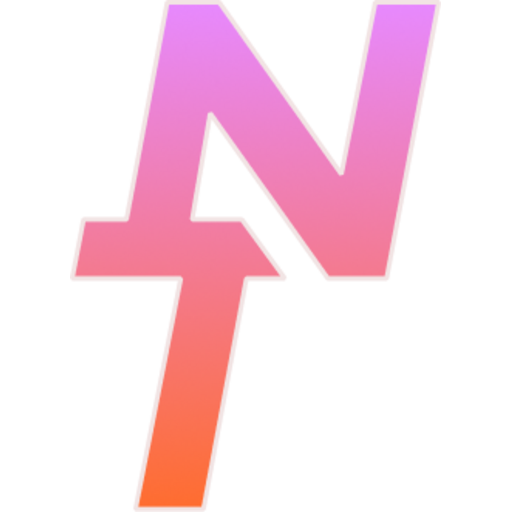

<p align="left">
  
<h1>NearsecTogether</h1>

[Inglês](README.md)\|[Espanhol](README.es.md)\|[Francês](README.fr.md)\|[Alemão](README.de.md)\|[Português](README.pt.md)\|[japonês](README.ja.md)

## Capturas de tela – Painel, Página do Visualizador, Arcade

<div align="center">
  
  
  
  
</div>

## Missão do Projeto

Nearsec Together é uma plataforma de código aberto que permite jogar jogos cooperativos locais pela Internet com amigos. Ele foi desenvolvido para configurações auto-hospedadas. Ele usa conexões ponto a ponto e roteamento de entrada e áudio do sistema operacional nativo para manter baixo o atraso de entrada.

O foco principal são as configurações privadas. O aplicativo host não requer configuração de rede especial. Os espectadores ingressam por meio de um navegador padrão em computadores ou dispositivos móveis. A interface do visualizador móvel inclui controles de toque e um joystick virtual. Os usuários não precisam baixar nada para jogar.

## Requisitos do sistema

Você precisa de um software específico instalado em sua máquina para executar o aplicativo host.

### Software necessário

-   Node.js versão 18 ou mais recente.
-   Python 3 para a ponte de virtualização do controlador.
-   Git para baixar o código fonte.

### Requisitos Linux

-   PipeWire deve ser seu servidor de áudio ativo. O aplicativo tem como alvo os nós PipeWire diretamente para separar o áudio do jogo dos bate-papos de voz. Não funcionará com PulseAudio.
-   Seu kernel deve ter o módulo uinput habilitado para que o aplicativo possa criar gamepads virtuais nativos.
-   O sistema implementa regras nativas do udev para bloquear sinalizadores de confusão do mouse e do teclado. Isso ignora os limites normais de entrada do Steam. O script de configuração fornecido cuida desta etapa.

### Requisitos do Windows

-   Você deve instalar o driver ViGEmBus manualmente para ativar o suporte ao gamepad no Windows.

### Dependências agrupadas

O aplicativo agrupa binários Cloudflared e Zrok para tunelamento e os executa nativamente. Você não precisa instalá-los manualmente. O roteamento da rede depende de um roteador Rust VPS externo para sinalização, enquanto o streaming de mídia ocorre por meio de WebRTC.

## Matriz de suporte da plataforma

| Recurso                    | Linux    | Windows      | macOS        |
| -------------------------- | -------- | ------------ | ------------ |
| Transmissão WebRTC         | Completo | Completo     | Completo     |
| Suporte para gamepad       | Completo | Condicional  | Nenhum       |
| Entrada de teclado e mouse | Completo | Limitado     | Completo     |
| Multicontrolador           | Completo | Limitado     | Nenhum       |
| Reprodução de áudio        | Completo | Completo     | Completo     |
| Nível de estabilidade      | Produção | Experimental | Experimental |

## Instalação e Documentação

A maioria dos usuários executará o arquivo executável compilado diretamente. O aplicativo gerencia a configuração do sistema automaticamente na inicialização.

Você só precisa executar o script de configuração manualmente se estiver usando o código-fonte ou se o aplicativo compilado não conseguir configurar seu sistema. Para executar o script de configuração do Linux manualmente, navegue até a pasta bin na raiz do projeto.

```bash
cd bin
sudo ./linux_setup.sh
```

Mantemos todas as instruções técnicas de configuração, listas de dependências e guias de API em um diretório de documentação dedicado. Isso mantém a página principal limpa. Você pode ler esses arquivos no ícone do livro Host Dashboard ou clicando nos links abaixo.

-   [Guia de primeiros passos](src/docs/GETTING_STARTED.md)
-   [Manual de uso do host](src/docs/HOST_USAGE.md)
-   [API e guia de configuração](src/docs/API_AND_SETUP.md)
-   [Configuração do servidor VPS](src/docs/VPS_SETUP.md)
-   [Documentação lógica avançada](src/docs/ADVANCED_LOGIC.md)
-   [Informações sobre o Arcade Nearsec](src/docs/NEARSEC_ARCADE.md)

## Arcada Nearsec

A plataforma inclui um sistema opcional de lobby público. Os anfitriões podem listar suas sessões na grade do Arcade para permitir que jogadores globais descubram e participem de jogos cooperativos locais. Você pode ver o lobby público em<https://nearsec.cutefame.net/arcade>e participe de sessões ativas diretamente do seu navegador.

Este projeto usa modelos de linguagem de inteligência artificial para geração de código e planejamento de estrutura.
